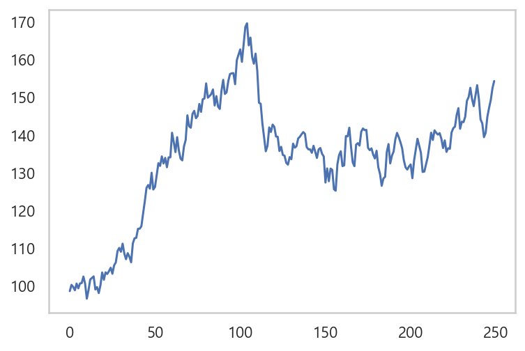

# Become a Python Data Analyst : Numpy
estraviz 의 데이터 분석 코스 중 numpy 튜토리얼에서 참고하였다. 5개의 섹션으로 이루어진 과정으로 데이터 분석에서
자주 사용되는 코드를 쉽게 이해할 수 있도록 정리되어 있다. 각 섹션은 numpy, pandas, EDA, scipy, linear regression 
나누어져 있다. 이 페이지에서는 numpy 섹션을 정리하였다. 

```
url : https://github.com/estraviz/Become-a-Python-Data-Analyst
```

## Motivating Examples

#### create array
- python 에서 numpy 의 기능을 사용하지 않고 배열을 만드는 방법은 일반적으로 list 데이터 타입을 사용하는 것.
- 거리와 시간에 대한 배열을 만든다.

```
distances = [10, 15, 17, 26, 20]
times = [0.3, 0.47, 0.55, 1.20, 1.0]
```

#### Calculate speeds with Python
- 속도를 구하기위해 for 문을 사용하여 list 의 데이터를 꺼낸 후 거리와 시간 값을 나눠준다.

```
speeds = []

for i in range(len(distances)) :
    speeds.append(distances[i]/times[i])
speeds
```
```
=====print=====

[33.333333333333336,
 31.914893617021278,
 30.909090909090907,
 21.666666666666668,
 20.0]
```

- 리스트 컴프리핸션을 사용하여 같은 계산을 할 수 있다.
```
[d/t for d,t in zip(distances, times)]
```
```
=====print=====

[33.333333333333336,
 31.914893617021278,
 30.909090909090907,
 21.666666666666668,
 20.0]
```

#### create array 2
- 상품의 수량과 가격을 배열로 만든 후, 총 금액을 구한다.
```
product_quantities = [13, 5, 6, 10, 11]
prices = [1.2, 6.5, 1.0, 4.8, 5.0]
total = sum([q*p for q,p in zip(product_quantities, prices)])
total
```
```
=====print=====
157.1
```

- list 데이터 타입은 list 끼리의 연산시 에러가 발생한다.
```
speeds = distances/times
total = (product_quantities*prices).sum()
```
```
=====print=====
TypeError: unsupported operand type(s) for /: 'list' and 'list'
```

#### creating arrays : from lists and using built-in functions
- numpy 의 배열은 다양한 수학 계산이 빠르고 쉽게 가능하다.
```
import numpy as np
```
- 위에서 만든 list 를 numpy 에 넣어 배열을 만든다.
```
distances = [10, 15, 17, 26, 20]
times = [0.3, 0.47, 0.55, 1.20, 1.0]
distances = np.array(distances)
times = np.array(times)

product_quantities = [13, 5, 6, 10, 11]
prices = [1.2, 6.5, 1.0, 4.8, 5.0]
product_quantities = np.array(product_quantities)
prices = np.array(prices)
```
```
distances

=====print=====
array([10, 15, 17, 26, 20])
```
#### np.array([[]])
- numpy array 에 이중 list 를 사용하면 2차원 배열, 삼중 list 를 사용하면 3차원 배열을 만들 수 있다.
```
A = np.array([[1,2], [3,4]])
```
```
=====print=====
array([[1, 2],
       [3, 4]])
```

#### np.zeros(())
- 0 벡터를 구현할 수 있다.
   - 0 벡터는  (()) 를 사용하며, shape, dtpye, order 의 옵션을 사용할 수 있다.
   - 0 이 10개인 배열
```
np.zeros((10), dtype=int)
```
```
array([0, 0, 0, 0, 0, 0, 0, 0, 0, 0])
```

#### np.ones(())
- 1 벡터를 구현할 수 있다.
   - 1 벡터는 (()) 를 사용하며, shape, dtype, order 의 옵션을 사용할 수 있다.
```
np.ones((3,5), dtype=float)
```
```
=====print=====
array([[1., 1., 1., 1., 1.],
       [1., 1., 1., 1., 1.],
       [1., 1., 1., 1., 1.]])
```

#### np.arange(start=a, stop=b, step=c)
- 연속적인 정수를 사용하여 배열을 구현할 수 있다.
```
np.arange(start=0, stop=20, step=2)
```
```
array([ 0,  2,  4,  6,  8, 10, 12, 14, 16, 18])
```

#### np.linspace(start=a, stop=b, num=c, axis=0)
- 불연속적인 실수를 사용하여 배열을 구현할 수 있다.
```
np.linspace(0, 1, 20)
```
```
=====print=====
array([0.        , 0.05263158, 0.10526316, 0.15789474, 0.21052632,
       0.26315789, 0.31578947, 0.36842105, 0.42105263, 0.47368421,
       0.52631579, 0.57894737, 0.63157895, 0.68421053, 0.73684211,
       0.78947368, 0.84210526, 0.89473684, 0.94736842, 1.        ])
```

#### some atrributes of arrays
- 배열의 차원, 형태, 크기를 확인 할 수 있다.
```
A = np.ones(shape=(3,4), dtype=float)
```
```
=====print=====

array([[1., 1., 1., 1.],
       [1., 1., 1., 1.],
       [1., 1., 1., 1.]])
```

```
A.ndim, A.shape, A.size

=====print=====
2, (3,4), 12
```

#### Basic math with arrays
- 위에서 만든 거리, 시간, 수량, 가격 array 로 수한 연산을 할 수 있다.
```
speeds = distances / times
```
```
=====print=====
array([33.33333333, 31.91489362, 30.90909091, 21.66666667, 20.        ])
```
```
values = product_quantities * prices
total = values.sum()
print(values)
total
```
```
=====print=====
[15.6 32.5  6.  48.  55. ]
157.1
```

#### 배열과 스칼라의 연산
- 배열과 스칼라의 연산을 할 수 있다.
```
x = np.arange(start=0, stop=20, step=2)
```
```
=====print=====
array([ 0,  2,  4,  6,  8, 10, 12, 14, 16, 18])
```

- 덧셈
```
x + 1

=====print=====
array([ 1,  3,  5,  7,  9, 11, 13, 15, 17, 19])
```

- 곱셈
```
x*2

=====print=====
array([ 0,  4,  8, 12, 16, 20, 24, 28, 32, 36])
```

- 나눗셈
```
x / 2

=====print=====
array([0., 1., 2., 3., 4., 5., 6., 7., 8., 9.])
```

#### universal functions
- 수학의 여러가지 함수들을 쉽게 구현할 수 있다.
- sin 값
```
np.sin(x)

=====print=====
array([ 0.        ,  0.90929743, -0.7568025 , -0.2794155 ,  0.98935825,
       -0.54402111, -0.53657292,  0.99060736, -0.28790332, -0.75098725])
```

- cos 값
```
np.cos(x)

=====print=====
array([ 1.        , -0.41614684, -0.65364362,  0.96017029, -0.14550003,
       -0.83907153,  0.84385396,  0.13673722, -0.95765948,  0.66031671])
```

- tan 값
```
np.tan(x)

=====print=====
array([ 0.        , -2.18503986,  1.15782128, -0.29100619, -6.79971146,
        0.64836083, -0.63585993,  7.24460662,  0.30063224, -1.13731371])
```

- 지수함수 값
```
np.exp(x)

=====print=====
array([1.00000000e+00, 7.38905610e+00, 5.45981500e+01, 4.03428793e+02,
       2.98095799e+03, 2.20264658e+04, 1.62754791e+05, 1.20260428e+06,
       8.88611052e+06, 6.56599691e+07])
```

- 로그함수 값
```
np.log(x+1)

=====print=====
array([0.        , 1.09861229, 1.60943791, 1.94591015, 2.19722458,
       2.39789527, 2.56494936, 2.7080502 , 2.83321334, 2.94443898])
```

- 제곱근
```
np.sqrt(x)

=====print======
array([0.        , 1.41421356, 2.        , 2.44948974, 2.82842712,
       3.16227766, 3.46410162, 3.74165739, 4.        , 4.24264069])
```

#### Common manipulations

##### indexing : 배열의 요소의 값을 가져오거나 값을 변경하는 기능
```
one_dim = np.linspace(-0.5, 0.6, 12
```
```
=====print=====

array([-0.5, -0.4, -0.3, -0.2, -0.1,  0. ,  0.1,  0.2,  0.3,  0.4,  0.5,
        0.6])
```

- one_dim 배열의 5 번째 값 선택
```
one_dim[5]

=====print=====
0.0
```

- one_dim 배열의 5 번째 값 변경
```
one_dim[5] = 1

=====print=====
array([-0.5, -0.4, -0.3, -0.2, -0.1,  1. ,  0.1,  0.2,  0.3,  0.4,  0.5,
        0.6])
```

- 배열의 로우와 컬럼을 선택, 값 변경
```
two_dim = np.array([[3,5,2,4,],[7,6,5,5],[1,6,-1,-1]])

=====print=====
array([[ 3,  5,  2,  4],
       [ 7,  6,  5,  5],
       [ 1,  6, -1, -1]])
```

```
two_dim[0, 3]

=====print=====
4
```
```
two_dim[0, 0] = -1

=====print=====
array([[-1,  5,  2,  4],
       [ 7,  6,  5,  5],
       [ 1,  6, -1, -1]])
```

##### slicing : 배열에서 부분배열을 선택하는 기능
```
one_dim
```
```
=====print=====
array([ 1. , -0.4, -0.3, -0.2, -0.1,  0. ,  0.1,  0.2,  0.3,  0.4,  0.5, 0.6])
```
```
print(one_dim[2:5])
print(one_dim[:5])
print(one_dim[-5:])
```
```
=====print=====
[-0.3 -0.2 -0.1]
[ 1.  -0.4 -0.3 -0.2 -0.1]
[0.2 0.3 0.4 0.5 0.6]
```

```
two_dim
```
```
=====print=====
array([[-1,  5,  2,  4],
       [ 7,  6,  5,  5],
       [ 1,  6, -1, -1]])
```

- 여러개의 row와 컬럼을 슬라이싱 할 수 있다.
```
print(two_dim[:2, :2])
print(two_dim[:, 1:3])
```
```
=====print=====
[[-1  5]
 [ 7  6]]

[[ 5  2]
 [ 6  5]
 [ 6 -1]]
```

##### array.reshape(a,b) : reshaping of arrays : 배열의 형태를 바꾸어주는 기능
- 배열의 형태변화는 크기가 같아야한다. (행 x 열 = 크기)

```
one_dim

=====print=====
array([ 1. , -0.4, -0.3, -0.2, -0.1,  0. ,  0.1,  0.2,  0.3,  0.4,  0.5, 0.6])
```
```
a1 = one_dim.reshape(2,6)
a2 = one_dim.reshape(3,4)
a3 = one_dim.reshape(4,3)
a4 = one_dim.reshape(6,2)
a5 = one_dim.reshape(2,2,3)
a6 = one_dim.reshape(2,1,6)
a7 = one_dim.reshape(3,2,2)
```
- size 확인
```
one_dim.size, a1.size, a2.size, a3.size, a4.size, a5.size, a6.size, a7.size

=====print=====
(12, 12, 12, 12, 12, 12, 12, 12)
```
- 형태가 바뀐 배열 확인
```
print(a1)
print(a2)
print(a3)
print(a4)
print(a5)
print(a6)
print(a7)

=====print=====

[[ 1.  -0.4 -0.3 -0.2 -0.1  0. ]
 [ 0.1  0.2  0.3  0.4  0.5  0.6]]
[[ 1.  -0.4 -0.3 -0.2]
 [-0.1  0.   0.1  0.2]
 [ 0.3  0.4  0.5  0.6]]
[[ 1.  -0.4 -0.3]
 [-0.2 -0.1  0. ]
 [ 0.1  0.2  0.3]
 [ 0.4  0.5  0.6]]
[[ 1.  -0.4]
 [-0.3 -0.2]
 [-0.1  0. ]
 [ 0.1  0.2]
 [ 0.3  0.4]
 [ 0.5  0.6]]
[[[ 1.  -0.4 -0.3]
  [-0.2 -0.1  0. ]]

 [[ 0.1  0.2  0.3]
  [ 0.4  0.5  0.6]]]
[[[ 1.  -0.4 -0.3 -0.2 -0.1  0. ]]

 [[ 0.1  0.2  0.3  0.4  0.5  0.6]]]
[[[ 1.  -0.4]
  [-0.3 -0.2]]

 [[-0.1  0. ]
  [ 0.1  0.2]]

 [[ 0.3  0.4]
  [ 0.5  0.6]]]
```

##### array.flatten() : 배열의 형태를 (0, n) 으로 바꾸어주는 기능
```
two_dim

=====print=====
array([[100,   4,   5,   2],
       [  5,   6,   7,   8],
       [ 10,  22,  24,  11]])
```
```
two_dim.flatten()

=====print=====
array([100,   4,   5,   2,   5,   6,   7,   8,  10,  22,  24,  11])
```

### coin flips 
- 동전을 던져서 앞면이 나오는 경우는 1, 뒷면이 나오는 경우는 0이라고 가정.
- 0, 1 의 배열을 만들고 동전 던지기를 시뮬레이션 해본다.
```
experiments = np.random.randint(0,2, size=10)
print(experiments)
print(experiments.sum())
```
```
=====print====
[1 1 0 1 1 0 1 1 1 1]
8
```

- 동전 던지기를 10번씩, 10000번 시행했을 때의 배열
```
coin_matrix = np.random.randint(0,2,size=(10000, 10))
coin_matrix[:10]

=====print=====
array([[1, 0, 0, 0, 1, 1, 0, 1, 1, 1],
       [1, 1, 0, 0, 1, 0, 1, 1, 1, 1],
       [0, 0, 1, 1, 1, 1, 0, 1, 0, 0],
       [0, 0, 1, 1, 0, 0, 1, 1, 0, 1],
       [0, 1, 1, 1, 1, 0, 0, 0, 0, 1],
       [1, 1, 1, 1, 0, 0, 0, 0, 0, 0],
       [1, 1, 1, 1, 1, 0, 1, 0, 1, 0],
       [0, 0, 1, 1, 1, 0, 1, 0, 0, 0],
       [1, 1, 1, 1, 0, 0, 1, 0, 0, 0],
       [1, 0, 1, 0, 1, 1, 0, 1, 0, 0]])
```
- 사이즈와 형태 확인
```
coin_matrix.size, coin_matrix.shape

=====print=====
(100000, (10000, 10))
```

- 각 시행별로 앞면(=1) 이 몇 번 나왔는지 확인
- axis 를 1로 설정하면 로우가 설정된다.
```
counts = coin_matrix.sum(axis=1)
counts[:20]

=====print=====
array([6, 7, 5, 5, 5, 4, 7, 4, 5, 5, 5, 5, 6, 5, 2, 3, 5, 5, 4, 7])
```

#### 기술 통계 확인
- 평균값
```
print(counts.mean())

=====print=====
4.9826
```
- 중앙값
```
print(np.median(counts))

=====print=====
5.0
```
- 최소값, 최대값
   - 1이 나온 횟수 이므로, 0 번과 10 번이 각각 최소, 최대값이 된다.
```
print(counts.min(), counts.max())

=====print=====
0 10
```
- 표준편차
```
print(counts.std())

=====print=====
1.5715906718990158
```

#### .bincount(array) : 배열의 각 요소의 갯수
- 앞 면이 나온 횟수는 한 번도 나오지 않았거나, 10 번 시행에서 10번 모두 나온 경우까지 분포한다. (0,1,2,3,...,10)
- 앞 면이 나온 횟수의 갯수를 파악한다.
- 3,4,5,6,7 의 경우의 수가 가장 많이 분포되어 있다.
```
np.bincount(counts)

=====print=====
[  12   87  415 1227 2111 2448 2000 1167  429   97    7]
```

#### 각 경우의 수의 전체 시행 횟수에 대한 비중 확인
```
unique_numbers = np.arange(1, 11)
observed_times = np.bincount(counts)
print("=====print=====")
for n, count in zip(unique_numbers, observed_times) :
    print("{} heads observed {} times ({:0.1f}%)".format(n, count, 100*count/2000))
```
```
=====print=====

1 heads observed 12 times (0.6%)
2 heads observed 87 times (4.3%)
3 heads observed 415 times (20.8%)
4 heads observed 1227 times (61.4%)
5 heads observed 2111 times (105.5%)
6 heads observed 2448 times (122.4%)
7 heads observed 2000 times (100.0%)
8 heads observed 1167 times (58.4%)
9 heads observed 429 times (21.4%)
10 heads observed 97 times (4.8%)
```

#### Simulating Staock Returns
- 주식 가격의 추이를 보여주는 임의의 배열을 그래프로 간단하게 구현할 수 있다.

- pyplot 패키지 사용
```
import matplotlib.pyplot as plt
%matplotlib inline
```

##### .random.normal()
- 0.001 ~ 0.02 사이의 실수 250개를 정규분포를 따르도록 선택하여 배열을 만든다.
```
returns = np.random.normal(0.001, 0.02, 250)
returns[:20]

=====print=====
array([-0.01503789,  0.01661053, -0.00544762, -0.00895208,  0.01788644,
       -0.01272239,  0.01302516,  0.00098677,  0.01695848, -0.0187837 ,
       -0.04015041,  0.02326267,  0.02803309,  0.00414953,  0.00398771,
       -0.03449537,  0.00625433, -0.01597197,  0.02084373,  0.03343271])
```

- 최초가격 설정
```
initial_price = 100
```

- 누적 증가량을 확인하기 위해 .cumsum() 을 사용
- 최초가격과 지수함수 값을 곱한다.
```
price = initial_price * np.exp(returns.cumsum())
```

#### 그래프로 확인
```
plt.plot(price)
plt.grid();
```


#### .cumsum() : 배열의 각 요소들을 누적하여 더해주는 기능
```
array1 = np.array([[1,2,3],[4,5,6],[1,1,1]])

=====print=====
array([[1, 2, 3],
       [4, 5, 6],
       [1, 1, 1]])
```
- .cumsum() 을 적용하면 배열의 형태가 flatten 해진다.
```
print(np.cumsum(array1))
print(np.cumsum(array1, dtype=float))

=====print=====
[ 1  3  6 10 15 21 22 23 24]
[ 1.  3.  6. 10. 15. 21. 22. 23. 24.]
```

- axis 를 설정하여 로우와 컬럼의 누적덧셈 값을 구할 수 있다.
- axis=0 -> 컬럼별 누적 계산, axis=1 -> 로우별 누적 계산
```
print(np.cumsum(array1, axis=0))

=====print=====
[[ 1  2  3]
 [ 5  7  9]
 [ 6  8 10]]
```
```
print(np.cumsum(array1, axis=1))

=====print=====
[[ 1  3  6]
 [ 4  9 15]
 [ 1  2  3]]
```
