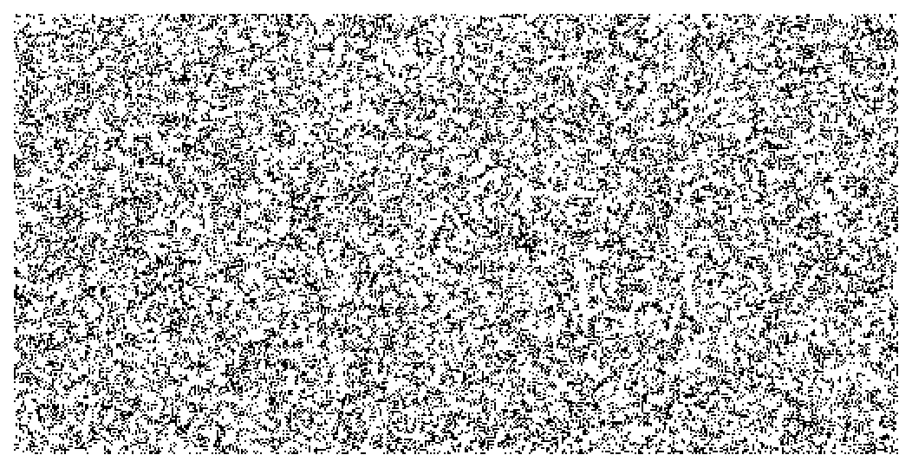
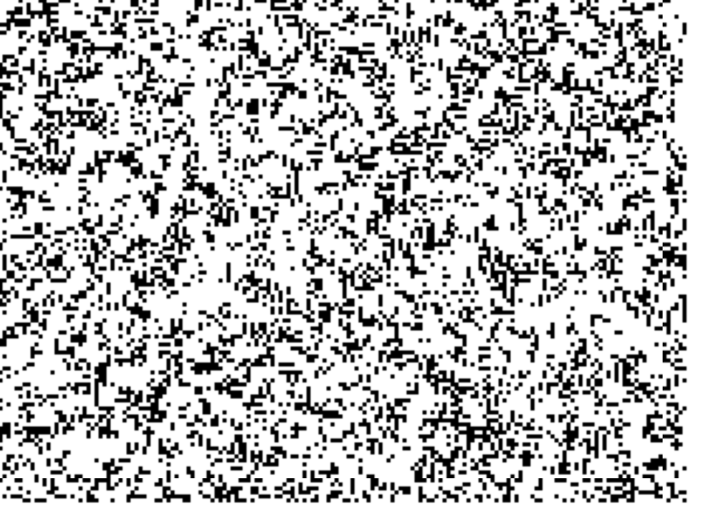
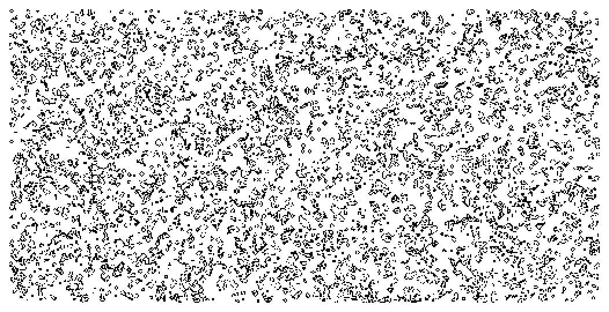
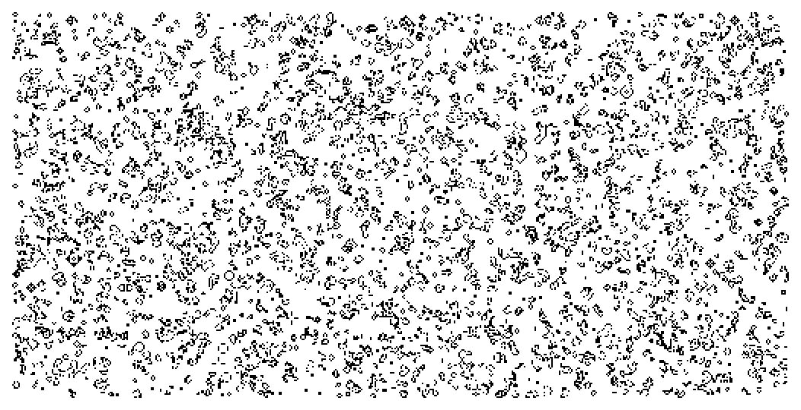
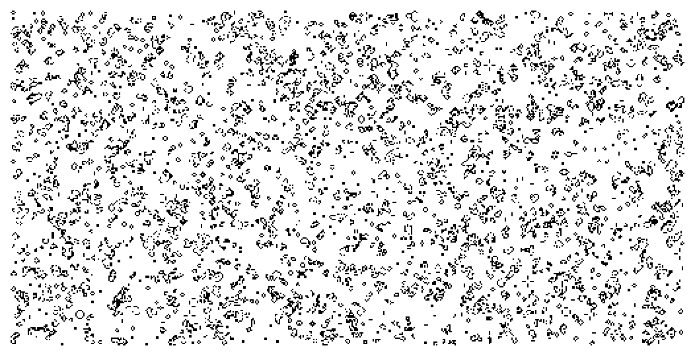
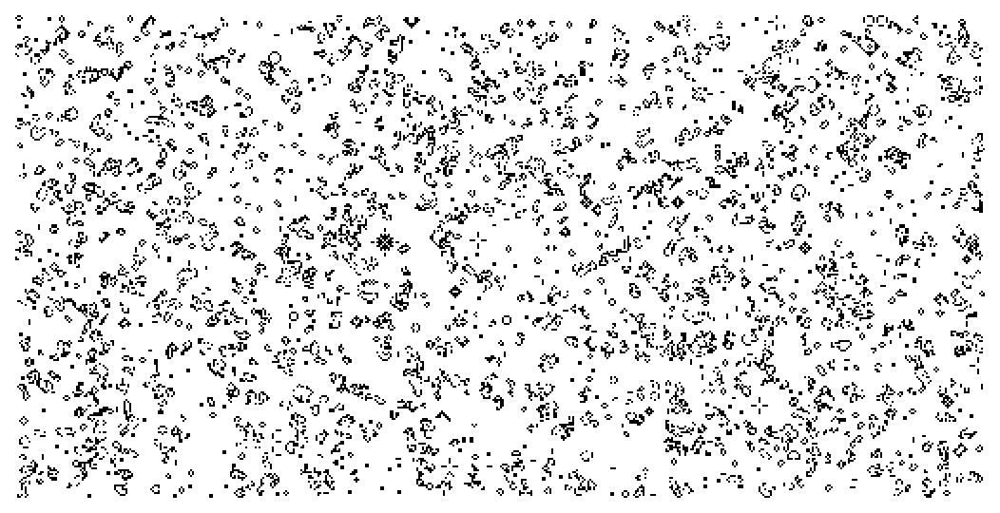
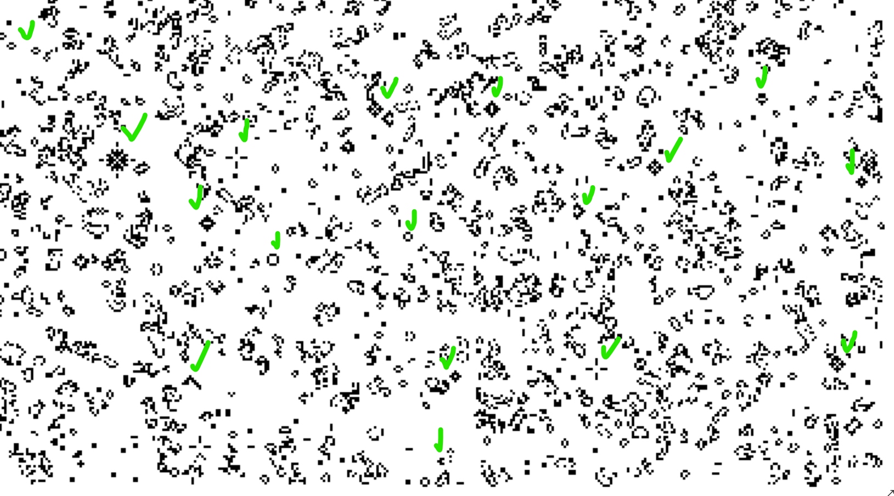
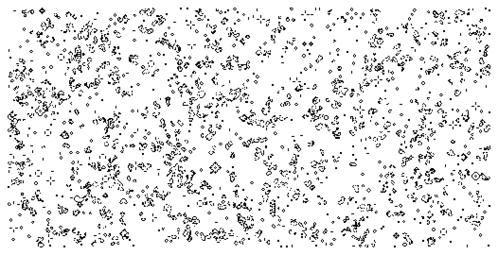

# Numpy tutorial
Nicolas P.Rogier 의 github 에 공개 된 numpy tutorial 을 참고하였다. 세포자동자 라는 수학적 이산모형을 numpy 배열로 만들어 보는 과정을 통해서 numpy 의 여러가지 기능과 장점들을 알아 볼 수 있었다. 특히 세포자동자 모델이 자연과학의 세포분열 과정과 유사한 측면이 있고, 이것을 더 심화 발전시키면 생화학의 한 분야에까지 접목될 수 있다는 것을 알게 되었다. 해당 tutorial 은 존 호턴 콘웨이가 만든 세포자동자 모델을 구현하는 방법에 대한 설명이며, 이를 토대로 다양한 세포자동자 모델을 만들어 볼 수 있을 것 같다.

이 tutorial 에서 소개하고 있는 numpy 패키지의 장점은,
```
python 을 사용한 과학 컴퓨팅의 기본 패키지
강력한 여러차원의 배열 객체
브로드캐스팅의 정교한 기능들
C/C++ 및 Fortran 언어와의 코드 통합 도구
유용한 선형대수, 푸리에 변환, 난수 발생 기능
```
으로 정리할 수 있다.

- 참고 url     https://github.com/rougier/numpy-tutorial#exercises

### cellular automaton numpy
- 세포자동자라는 의미의 수학적 이산모형이다.
- 규칙적인 격자 형태로 배열된 세포, 또는 칸이 살아있음과 죽음의 두가지 상태를 취함으로써 발생하는 규칙성을 수학적 모델로 구현한 것이다.
- cell 의 살아있음과 죽음은 이웃하는 다른 세포와의 관계에서 기인한다.
- 세포 간의 관계는 모든 세포에 적용되며, 초기상태로부터 시간이 지날때마다 새로운 세대가 만들어지고, 일정한 규칙을 따른다..
- 1940년 스타니스와프 울람과 존 폰 노이만이 연구하였고, 1970년 존 호턴 콘웨이의 라이프 게임에 의해 알려졌다.
- 이후 다양한 세포자동자 규칙들이 고안되었고, 단순한 규칙으로 복잡한 패턴을 구현할 수 있어, 컴퓨팅, 수학, 알고리즘 등에서 사용되기도 한다.

### The Game of Life
- 존 호턴 콘웨이가 고안한 세포자동자이다.
- 많은 사각형 격자위에서 진행되며, cell 과 cell 주변에 인접한 8개의 이웃 cell 이 있다.
- 각 cell 은 살아있거나 죽어있는 상태 중 하나를 취한다.
- 현재 세포의 전체 상태가 다음 세대의 전체 상태를 결정한다.
- 규칙
    - "Any live cell with fewer than two live neighbours dies, as if by needs caused by underpopulation." : 살아있는 하나의 세포는 주변에 2 개 이하의 이웃세포가 있으면 인구부족으로 죽는다.
    - "Any live cell with more than three live neighbours dies, as if by overcrowding." : 살아있는 하나의 세포는 주변에 3개 이상의 이웃세포가 있으면 인구과잉으로 죽는다.
    - "Any live cell with two or three live neighbours lives, unchanged, to the next generation." : 살아있는 하나의 세포는 주변에 2개 또는 3개의 이웃세포가 있으면, 바뀌는 것 없이 다음 세대가 된다.
    - "Any dead cell with exactly three live neighbours becomes a live cell." : 주변에 세 개의 살아있는 이웃세포가 있는 죽은세포는 살아나게 된다.

### patterns
- still life (정물) : block, boat (고정된 패턴)
- oscillator (진동자) : blinker, toad (일정한 행동을 주기적으로 반복하는 패턴)
- spaceship (우주선) : glider, LWSS (한쪽 방향으로 계속 전진하는 패턴)
- 이외에도 총, 기관차, 갈퀴, 사육사 등의 여러 패턴들이 있다.
- 패턴들은 서로 합성하거나 성장할 수 있다.
- 또한 규칙들이 추가되며 복잡하고 다양한 패턴들이 고안되었다.
    - 아메바, 불사조, 레이스, 산호초, 피라미드 등
    
.gif)

### The way of python
- 파이썬의 배열 인터페이스를 사용하여 세포자동화를 구현해본다.
- 세포의 이웃 수를 계산할 때 용이하도록 주변에 0을 배치한다.

- 6x6 행렬 안에 glitter 패턴을 구현한다.
```
Z = [
    [0,0,0,0,0,0],
    [0,0,0,1,0,0],
    [0,1,0,1,0,0],
    [0,0,1,1,0,0],
    [0,0,0,0,0,0],
    [0,0,0,0,0,0]
]
Z
```
```
=====print=====
[[0, 0, 0, 0, 0, 0],
 [0, 0, 0, 1, 0, 0],
 [0, 1, 0, 1, 0, 0],
 [0, 0, 1, 1, 0, 0],
 [0, 0, 0, 0, 0, 0],
 [0, 0, 0, 0, 0, 0]]
```
### first : count neighbours
- 셀 주변의 이웃 셀의 갯수를 센다.
```
def compute_neighbours(Z) :
    shape = len(Z), len(Z[0])    # (6,6)
    N = [[0,] * (shape[0]) for i in range(shape[1])]        # 1*6 크기의 리스트 6개 생성

    # 3*3 크기의 사각형안의 1을 더해준다. 즉 1=살아있는 세포의 갯수를 의미한다.
    # 3*3 크기의 사각형이 한칸씩 이동하면서, 1의 갯수를 세고, 해당 index 에 저장한다.
    # 바깥쪽 0 요소들을 빼고 1,1 부터 시작.
    for x in range(1, shape[0]-1) :                         # 1,2,3,4
        for y in range(1, shape[1]-1) :                     # 1,2,3,4
            N[x][y] = Z[x-1][y-1]+Z[x][y-1]+Z[x+1][y-1] \
                    + Z[x-1][y]            +Z[x+1][y]   \
                    + Z[x-1][y+1]+Z[x][y+1]+Z[x+1][y+1]
    return N
```
### 코드 탐색
- 이중 리스트로 만들어진 Z 의 길이와 0 번째 리스트의 길이
```
test = len(Z), len(Z[0])
test

=====print=====
(6, 6)
```

- 리스트컴프리핸션을 사용하여 간단하게 모든 값이 0으로 구성 된 길이 6의 리스트를 6개 만든다.
```
test2 = [[0,] * (test[0]) for i in range(test[1])]
test2

=====print=====
[[0, 0, 0, 0, 0, 0],
 [0, 0, 0, 0, 0, 0],
 [0, 0, 0, 0, 0, 0],
 [0, 0, 0, 0, 0, 0],
 [0, 0, 0, 0, 0, 0],
 [0, 0, 0, 0, 0, 0]]
```
- 0 을 6개 만드는 방법
```
[0,]*6

=====print=====
[0, 0, 0, 0, 0, 0]
```

- 배열에서 각 지점의 주위에 몇 개의 살아있는 이웃 셀이 있는지 세어주는 코드
- 3x3 크기의 프레임의 원소들을 다 더한 값을 ```N[x][y]``` 좌표에 저장한다.
```
for x in range(1, shape[0]-1) :     
        for y in range(1, shape[1]-1) : 
            N[x][y] = Z[x-1][y-1]+Z[x][y-1]+Z[x+1][y-1] \
                    + Z[x-1][y]            +Z[x+1][y]   \
                    + Z[x-1][y+1]+Z[x][y+1]+Z[x+1][y+1]
```

- compute_neighbour 함수를 실행해보면 현재 지점의 주변에 몇 개의 살아있는 셀이 있는지 갯수가 나타나있다.
- 이렇게 구해진 이웃셀의 갯수가 현재 셀의 상태를 결정하는 조건에서 쓰이게 된다.
```
test = compute_neighbours(Z)
test

=====print=====
[[0, 0, 0, 0, 0, 0],
 [0, 1, 3, 1, 2, 0],
 [0, 1, 5, 3, 3, 0],
 [0, 2, 3, 2, 2, 0],
 [0, 1, 2, 2, 1, 0],
 [0, 0, 0, 0, 0, 0]]
```


### second : count the number of neighbours and 4 rules update
- 세포자동화 모델에서 세포가 살아있거나 죽어있는 경우에 대한 규칙 4가지를 적용하는 코드
- 배열의 비교연산자를 사용하면 T, F 로 반환된다. 이것을 사용하여 세포의 상태를 정의해준다.
```
def iterate(Z) :
    shape = len(Z), len(Z[0])
    N = compute_neighbours(Z)                # 지점별로 이웃셀의 갯수를 세어주는 함수 실행후 값을 N 에 저장
    for x in range(1, shape[0]-1) :          # 1,2,3,4
        for y in range(1, shape[1]-1) :      # 1,2,3,4

            # 어떤 좌표의 값이 1이고, 이 좌표의 주변 셀의 갯수가 2보다 작거나, 3보다 큰 경우 
	    # 해당 좌표의 데이터를 0으로 바꾼다. (죽어있음)
            if Z[x][y] == 1 and (N[x][y] < 2 or N[x][y] > 3) :
                Z[x][y] = 0
            
	    # 어떤 좌표의 갑이 0이고, 이 좌표의 주변 셀의 갯수가 3이면, 
	    # 해당 좌표의 데이터를 1로 바꾼다. (살아있음)
            elif Z[x][y] == 0 and N[x][y] == 3 :
                Z[x][y] = 1
    return Z
```

#### 세포가 글리터 형태로 이동하는 모습을 확인 할 수있다.
- 처음 Z 행렬에서 글리터 패턴을 정의했고,
- counter 함수로 각 세포 위치별로 주변에 살아있는(1) 세포의 수를 세어준다.
- 좌표별로 최초 규칙에 부합하는지 여부를 조사하여, 0 또는 1로 변경한다.
- 한 세대에서 다음 세대로 이동하는 의미이다.
```
def show(Z) :
    for l in Z[1:-1] :   # Z 의 처음과 끝의 행을 제외한 가운데 행만 적용.
        print(l[1:-1])
    print()
```

- iterate 함수를 4번 반복 실행하면, 각 실행마다 셀의 상태가 바뀌는 모습을 볼 수 있다.
- 즉 각 지점의 셀마다 주변의 이웃셀의 갯수를 세고, 현재 셀의 상태와 이웃셀의 갯수에 따라서
- 주어진 조건문에 의해 셀의 상태가 결정된다. 살아있거나, 죽어있거나, 현재상태를 유지하게 된다.
- 최초의 Z 의 글리터가 4 세대를 거쳐 아래쪽으로 이동한 모습이다.
```
show(Z)
for i in range(4) :
    iterate(Z)
show(Z)
```
```
[0, 0, 1, 0]
[1, 0, 1, 0]
[0, 1, 1, 0]
[0, 0, 0, 0]

[0, 0, 0, 0]
[0, 0, 0, 1]
[0, 1, 0, 1]
[0, 0, 1, 1]
```

### 코드 탐색
- 이중리스트로 된 데이터도 for 문에서 사용할 수 있다.
- for 문을 돌면서 안쪽 리스트가 순차적으로 출력된다.
```
test_data = [[1,2,3],[4,5,6],[7,8,9]]

for test in test_data :
    print(test)
    print(test[0])
```
```
[1, 2, 3]
1
[4, 5, 6]
4
[7, 8, 9]
7
```

### 정리
```
def compute_neighbours(Z) :                            # 이웃하는 셀의 갯수를 세어주는 함수
    shape = len(Z), len(Z[0])                          
    N = [[0,] * (shape[0]) for i in range(shape[1])]   # 0 이 6 개인 1차원 배열

    for x in range(1, shape[0]-1) :                    # 이중 for 문을 돌면서 각 지점을 돌며 주위의 셀을 센다.
        for y in range(1, shape[1]-1) : 
            N[x][y] = Z[x-1][y-1]+Z[x][y-1]+Z[x+1][y-1] \
                    + Z[x-1][y]            +Z[x+1][y]   \
                    + Z[x-1][y+1]+Z[x][y+1]+Z[x+1][y+1]
    return N

def iterate(Z) :                                       # 주어진 주건에 따라 셀의 상태를 결정하는 함수
    shape = len(Z), len(Z[0])
    N = compute_neighbours(Z)                          # 이웃하는 셀을 세어주는 함수 실행
    
    for x in range(1, shape[0]-1) :   
        for y in range(1, shape[1]-1) :   
                                                       # 셀의 상태를 결정하는 조건을 정의
            if Z[x][y] == 1 and (N[x][y] < 2 or N[x][y] > 3) :
                Z[x][y] = 0
            elif Z[x][y] == 0 and N[x][y] == 3 :
                Z[x][y] = 1
    return Z

def show(Z) :                   # 배열의 테두리를 제외한 가운데 부분으로 슬라이싱 하는 함수
    for l in Z[1:-1] :
        print(l[1:-1])
    print()
```

### The way of numpy
- 세포자동자를 넘파이로 구현해본다.

#### first : create the proper numpy array to hold the cells
- 넘파이 배열안에 글리터 패턴을 넣는다.
```
import numpy as np
```
```
Z = np.array([
    [0,0,0,0,0,0],
    [0,0,0,1,0,0],
    [0,1,0,1,0,0],
    [0,0,1,1,0,0],
    [0,0,0,0,0,0],
    [0,0,0,0,0,0],
])
Z
```
```
=====print=====
array([[0, 0, 0, 0, 0, 0],
       [0, 0, 0, 1, 0, 0],
       [0, 1, 0, 1, 0, 0],
       [0, 0, 1, 1, 0, 0],
       [0, 0, 0, 0, 0, 0],
       [0, 0, 0, 0, 0, 0]])
```

#### data type of the array
- numpy 는 기본적으로 정수가 입력되면 정수 데이터 타입으로 나온다.
```
print(Z.dtype)

=====print=====
int32
```

#### shape of the array
- array 의 모양을 확인
```
print(Z.shape)

=====print=====
(6, 6)
```
#### indexing
```
print(Z[0,5])

=====print=====
0
```
#### slicing
```
print(Z[1:5, 1:5])

=====print=====
[[0 0 1 0]
 [1 0 1 0]
 [0 1 1 0]
 [0 0 0 0]]
```
#### set the value of data
- 슬라이싱 하여 저장한 변수는 .base 매서드로 포함여부를 확인 할 수 있다.
```
A = Z[1:5, 1:5]
A[0,0] = 9
print(A)
```
```
=====print=====
[[9 0 1 0]
 [1 0 1 0]
 [0 1 1 0]
 [0 0 0 0]]
```
```
print(Z.base is None)

=====print=====
True
```
```
print(A.base is Z)

=====print=====
True
```

#### Counting neighbours : numpy array vectorization
- numpy array 에서 이웃셀의 수를 카운팅하기 위해 array 를 스칼라 값으로 처리하는 것을 의미한다.
- 앞에서 python 코드는 중첩된 루프들에 의해서 속도가 느리다.

```
(1+(2*Z+3))[i,j] == (1+(2*Z[i,j]+3))
```

#### Broadcasting : count neighbours
- 행렬과 스칼라를 연산하기 위한 방법.
- A 행렬과 B 스칼라의 연산에서 스칼라 B 를 A 행렬의 크기에 맞게 확장시켜서 같은 크기로 만든 후 계산해준다.
- 스칼라를 행렬의 모든 요소에 계산해주는 방식으로 numpy array 의 큰 특징이다.
- 배열에 스칼라를 더하면 전체 요소에 더 해진다.
```
print(Z+1)

=====print=====
[[1 1 1 1 1 1]
 [1 1 1 2 1 1]
 [1 2 1 2 1 1]
 [1 1 2 2 1 1]
 [1 1 1 1 1 1]
 [1 1 1 1 1 1]]
```

- 0 벡터를 만들때 옵션으로 Z.shape 를 하면 Z 의 형태인 6*6 이 적용된다.
```
N = np.zeros(Z.shape, dtype=int)
print(N)

=====print=====
[[0 0 0 0 0 0]
 [0 0 0 0 0 0]
 [0 0 0 0 0 0]
 [0 0 0 0 0 0]
 [0 0 0 0 0 0]
 [0 0 0 0 0 0]]
```

- broadcasting 사용하지 않고도 계산 가능.
- Z 와 형태가 같고 모든 값이 0인 N 행렬을 만들고,
- Z를 4*4 형태로 슬라이싱 한 부분들을 한 칸씩 이동하며, 누적 계산 해주면 각 지점의 주위에 1의 총합을 알 수 있다.
```
N[1:-1, 1:-1] += (Z[:-2, :-2] + Z[:-2, 1:-1] + Z[:-2, 2:] +
                  Z[1:-1, :-2]             + Z[1:-1, 2:] +
                  Z[2:, :-2] + Z[2:, 1:-1] + Z[2:, 2:])
```
```
N

=====print=====
array([[0, 0, 0, 0, 0, 0],
       [0, 1, 3, 1, 2, 0],
       [0, 1, 5, 3, 3, 0],
       [0, 2, 3, 2, 2, 0],
       [0, 1, 2, 2, 1, 0],
       [0, 0, 0, 0, 0, 0]])
```

### Iterate function
- .ravel() : 배열을 flatten 하게 바꿔준다.
- .argwhere() : 배열에서 주어진 조건의 T, F 를 받아서 T 에 해당하는 index 를 1열의 형태로 반환해준다.
```
def iterate(Z) :
    # Iterate the game of life : naive version
    # Count neighbours
    N = np.zeros(Z.shape, int)
    N[1:-1, 1:-1] += (Z[0:-2,0:-2] + Z[0:-2,1:-1] + Z[0:-2,2:] +
                      Z[1:-1,0:-2]                + Z[1:-1,2:] +
                      Z[2:  ,0:-2] + Z[2:  ,1:-1] + Z[2:  ,2:])

    # 배열을 1*N 의 형태로 바꾼다.
    N_ = N.ravel()
    Z_ = Z.ravel()

    # Apply rules
    R1 = np.argwhere((Z_==1) & (N_<2))   # 현재위치의 값이 1이고, 현재위치 주변 이웃 셀의 갯수가 2 미만
    R2 = np.argwhere((Z_==1) & (N_>3))   # 현재위치의 값이 1이고, 현재위치 주변 이웃 셀의 갯수가 3 초과
    R3 = np.argwhere((Z_==1) & ((N_==2) | (N_==3)))   # 현재 위치의 값이 1이고, 현재위치 주변 이웃 셀의 갯수가 2개이거나, 3개
    R4 = np.argwhere((Z_==0) & (N_==3))   # 현재위치의 값이 0이고, 현재위치 주변 이웃 셀의 갯수가 3

    # Set new values
    Z_[R1] = 0         # R1 이면 셀은 죽는다.
    Z_[R2] = 0         # R2 이면 셀은 죽는다.
    Z_[R3] = Z_[R3]    # R3 이면 현재 상태가 유지된다.
    Z_[R4] = 1         # R4 이면 셀은 살아난다.

    # Make sure borders stay null -> 행렬의 상하좌우 테두리 슬라이싱
    Z[0,:] = Z[-1,:] = Z[:,0] = Z[:,-1] = 0
```
### iterate 실행
- 한번 iterate 함수가 실행될 떄마다 셀의 상태가 바뀐다.
- 4번의 실행이 끝나면 처음 글리터의 위치가 바뀌어 있는 것을 볼 수 있다.
```
print("==최초의 글리터==")
print(Z)
for i in range(4) :
    print("==={} 번째 이동===".format(i))
    iterate(Z)
    print(Z)
```
```
==최초의 글리터==
[[0 0 0 0 0 0]
 [0 0 0 1 0 0]
 [0 1 0 1 0 0]
 [0 0 1 1 0 0]
 [0 0 0 0 0 0]
 [0 0 0 0 0 0]]
===0 번째 이동===
[[0 0 0 0 0 0]
 [0 0 1 0 0 0]
 [0 0 0 1 1 0]
 [0 0 1 1 0 0]
 [0 0 0 0 0 0]
 [0 0 0 0 0 0]]
===1 번째 이동===
[[0 0 0 0 0 0]
 [0 0 0 1 0 0]
 [0 0 0 0 1 0]
 [0 0 1 1 1 0]
 [0 0 0 0 0 0]
 [0 0 0 0 0 0]]
===2 번째 이동===
[[0 0 0 0 0 0]
 [0 0 0 0 0 0]
 [0 0 1 0 1 0]
 [0 0 0 1 1 0]
 [0 0 0 1 0 0]
 [0 0 0 0 0 0]]
===3 번째 이동===
[[0 0 0 0 0 0]
 [0 0 0 0 0 0]
 [0 0 0 0 1 0]
 [0 0 1 0 1 0]
 [0 0 0 1 1 0]
 [0 0 0 0 0 0]]
```

### 코드 탐색
- .ravel() 은 배열을 flatten 하게 바꿔준다. 
- .flatten() 과 같은 기능
```
test_ = test.ravel()
test_

=====print=====
array([0, 1, 1, 1, 1, 1, 0, 0, 1])
```

- 배열에 비교연산자를 사용하면 T, F 로 반환된다.
```
test_ < 1

=====print=====
array([ True, False, False, False, False, False,  True,  True, False])
```

- .argwhere() 는 T, F 에서 T 의 인덱스 값을 1열의 형태로 반환한다.
```
test_rule = np.argwhere(test_ < 1)
test_rule

=====print=====
array([[0],
       [6],
       [7]], dtype=int64)
```
- .aggwhere() 매서드로 반환 된 배열은 인덱싱이 가능하다.
```
print(test_rule[1])
print(test_rule[1][0])

=====print=====
[6]
6
```

- 처음 배열에 T 의 위치를 저장한 변수를 넣으면, 해당 위치의 값만 출력할 수 있다.
```
test_[test_rule]

=====print=====
array([[0],
       [0],
       [0]])
```

### iterate 2
- .argwhere 매서드를 사용하여 4개의 룰을 적용하면 코드 실행이 느려져 최적화가 안된다.
- numpy 의 배열에 직접 조건을 적용하여 bool 타입으로 변환한 후 이를 다시 int 로 변환 시킬 수 있다.
- 매우 간단한 코드로 세포자동화 모델을 만들 수 있다.
```
def iterate_2(Z) :
    # Count neighbours 이웃셀의 갯수를 세어준다
    N = (Z[0:-2,0:-2] + Z[0:-2,1:-1] + Z[0:-2,2:] +
         Z[1:-1,0:-2]                + Z[1:-1,2:] +
         Z[2:  ,0:-2] + Z[2:  ,1:-1] + Z[2:  ,2:])

    # Apply rulse 셀이 상태를 결정하는 조건을 정의한다.
    birth = (N==3) & (Z[1:-1,1:-1]==0)
    survive = ((N==2) | (N==3)) & (Z[1:-1,1:-1]==1)
    Z[...] = 0
    Z[1:-1,1:-1][birth | survive] = 1
    
    return Z
```

#### iterate_2 함수 실행
- 최초 글리터의 위치에서 이동한 것을 볼 수 있다.
```
for i in range(4) : iterate_2(Z)
print(Z)

=====print=====
[[0 0 0 0 0 0]
 [0 0 0 0 0 0]
 [0 0 0 0 1 0]
 [0 0 1 0 1 0]
 [0 0 0 1 1 0]
 [0 0 0 0 0 0]]
```
### 코드 탐색
#### 4*4 사각형 범위로 이웃하는 셀 카운팅
- 현재 살아있는 글리터 셀을 4*4 형태의 사각형 범위로 이동하며 살아있는 셀을 더해주면 각 지점의 주변에 살아있는 셀의 갯수를 세어주는 것과 같다.

```
N = (Z[0:-2,0:-2] + Z[0:-2,1:-1] + Z[0:-2,2:] +
     Z[1:-1,0:-2]                + Z[1:-1,2:] +
     Z[2:  ,0:-2] + Z[2:  ,1:-1] + Z[2:  ,2:])
```
```
N

=====print=====
array([[1, 3, 1, 2],
       [1, 5, 3, 3],
       [2, 3, 2, 2],
       [1, 2, 2, 1]])
```
#### Birth 조건 
- 죽어있는 셀을 살아있는 셀로 변환한다.
```
birth = (N==3) & (Z[1:-1,1:-1]==0)
```
- 이웃셀의 갯수가 3인 경우
```
N == 3

=====print=====
array([[False,  True, False, False],
       [False, False,  True,  True],
       [False,  True, False, False],
       [False, False, False, False]])
```

- 현재 죽어있는 셀인 경우
```
Z[1:-1,1:-1] == 0

=====print=====
array([[ True,  True, False,  True],
       [False,  True, False,  True],
       [ True, False, False,  True],
       [ True,  True,  True,  True]])
```

- 현재 죽어있는 셀이면서, 주변에 이웃하는 셀의 갯수가 3 인 셀을 가리킨다.
```
(N == 3) & (Z[1:-1,1:-1] == 0)

=====print=====
array([[False,  True, False, False],
       [False, False, False,  True],
       [False, False, False, False],
       [False, False, False, False]])
```

#### Survive 조건 : 현재 셀의 상태를 유지한다.
```
survive = ((N==2) | (N==3)) & (Z[1:-1,1:-1]==1)
```

- 셀 주변에 이웃하는 셀이 2 또는 3 인 것들을 가리킨다.
```
((N==2) | (N==3))

=====print=====
array([[False,  True, False,  True],
       [False, False,  True,  True],
       [ True,  True,  True,  True],
       [False,  True,  True, False]])
```

- 현재 살아있는 글리터 자신을 가리킨다.
```
(Z[1:-1,1:-1]==1)

=====print=====
array([[False, False,  True, False],
       [ True, False,  True, False],
       [False,  True,  True, False],
       [False, False, False, False]])
```

- 현재 살아있는 셀이면서, 주위에 이웃하는 셀이 2 또는 3 인 셀만 남는다. 
```
((N==2) | (N==3)) & (Z[1:-1,1:-1]==1)

=====print=====
array([[False, False, False, False],
       [False, False,  True, False],
       [False,  True,  True, False],
       [False, False, False, False]])
```

#### Birth 와 Survive 조건을 적용
- 현재 살아있는 글리터를 기준으로 모든 지점의 셀의 이웃하는 셀의 갯수를 파악한 후 규칙에 따라서 어떤 셀은 죽게되고 어떤 셀은 살아남거나, 어떤 셀은 새로 살아나게 된다.
- 함수가 한 번 실행될때마다 새로운 세대가 나타나는 것과 같다.

- Z 행렬을 0 으로 초기화하고
```
Z[...] = 0
Z

=====print=====
array([[0, 0, 0, 0, 0, 0],
       [0, 0, 0, 0, 0, 0],
       [0, 0, 0, 0, 0, 0],
       [0, 0, 0, 0, 0, 0],
       [0, 0, 0, 0, 0, 0],
       [0, 0, 0, 0, 0, 0]])
```

- birth, survive 조건 적용
```
Z[1:-1,1:-1][birth | survive] = 1
Z

=====print=====
array([[0, 0, 0, 0, 0, 0],
       [0, 0, 1, 0, 0, 0],
       [0, 0, 0, 1, 1, 0],
       [0, 0, 1, 0, 0, 0],
       [0, 0, 0, 0, 0, 0],
       [0, 0, 0, 0, 0, 0]])
```

### Getting bigger
- 작은 배열이 아닌 큰 배열에서 game of life 를 적용해 본다.

#### First, initialize the array by randomly
- 0과 1의 배열을 256x512 크기로 랜덤하게 만든다.
- 131,072 개의 전체 셀과  살아있는 셀 65,775 개, 죽어있는 셀은 65,297 개가 생성됐다.
```
Z = np.random.randint(0,2, (256,512))
```
```
Z.shape, Z.size

=====print=====
((256, 512), 131072)
```
```
Z[0], len(Z[0])

=====print=====
(array([0, 0, 0, 1, 1, 1, 1, 1, 1, 1, 1, 0, 0, 0, 1, 0, 1, 1, 0, 0, 1, 0,
        1, 1, 1, 1, 0, 1, 0, 0, 0, 1, 0, 0, 0, 0, 1, 1, 0, 0, 1, 1, 0, 1,
        0, 0, 1, 0, 0, 1, 0, 0, 0, 0, 1, 1, 1, 0, 1, 1, 1, 0, 0, 1, 1, 0,
        0, 1, 0, 1, 1, 1, 1, 0, 1, 0, 0, 1, 0, 1, 1, 1, 0, 0, 1, 0, 1, 1,
        1, 0, 0, 0, 0, 1, 1, 0, 1, 0, 1, 0, 1, 0, 0, 0, 0, 1, 1, 1, 0, 1,
        0, 0, 1, 1, 1, 0, 1, 1, 1, 1, 0, 0, 0, 0, 0, 0, 1, 1, 1, 0, 0, 0,
        0, 0, 0, 1, 0, 0, 1, 0, 1, 0, 0, 0, 1, 0, 0, 0, 1, 1, 1, 1, 0, 1,
        0, 0, 0, 0, 0, 0, 1, 0, 1, 0, 1, 1, 0, 0, 1, 1, 1, 0, 0, 1, 0, 1,
        1, 0, 0, 1, 1, 0, 0, 1, 0, 1, 1, 0, 0, 1, 0, 0, 0, 1, 0, 0, 0, 1,
        0, 1, 0, 0, 1, 0, 1, 0, 1, 1, 0, 1, 0, 0, 0, 0, 1, 0, 0, 1, 1, 1,
        0, 1, 0, 1, 1, 1, 1, 0, 0, 1, 0, 1, 0, 0, 1, 1, 0, 0, 0, 0, 0, 0,
        0, 1, 1, 0, 0, 1, 1, 1, 0, 1, 1, 1, 1, 1, 1, 0, 1, 0, 0, 1, 1, 1,
        1, 0, 1, 0, 1, 1, 1, 0, 1, 0, 0, 0, 1, 1, 0, 1, 0, 0, 0, 1, 1, 1,
        1, 1, 1, 1, 1, 1, 0, 1, 1, 1, 0, 1, 0, 1, 1, 0, 1, 0, 0, 1, 0, 1,
        0, 1, 0, 1, 0, 0, 0, 1, 1, 1, 1, 0, 0, 0, 0, 1, 1, 1, 1, 0, 1, 1,
        0, 1, 0, 1, 0, 1, 0, 1, 1, 1, 1, 1, 0, 0, 0, 1, 1, 1, 0, 1, 0, 0,
        1, 1, 0, 0, 0, 0, 1, 0, 1, 0, 1, 1, 0, 1, 1, 0, 1, 1, 1, 1, 1, 1,
        0, 1, 0, 0, 0, 0, 0, 1, 0, 1, 1, 0, 1, 0, 0, 0, 0, 0, 0, 0, 0, 1,
        1, 1, 1, 1, 0, 0, 0, 1, 0, 1, 0, 0, 0, 1, 1, 1, 1, 1, 1, 0, 0, 0,
        1, 0, 1, 0, 1, 1, 0, 0, 1, 0, 1, 1, 0, 0, 0, 1, 0, 0, 1, 0, 1, 1,
        0, 0, 0, 1, 1, 1, 0, 0, 1, 1, 0, 1, 0, 0, 0, 0, 1, 1, 0, 1, 1, 0,
        1, 0, 1, 1, 1, 0, 0, 1, 1, 1, 0, 0, 1, 0, 1, 0, 1, 1, 0, 1, 0, 0,
        0, 1, 1, 1, 0, 0, 0, 0, 1, 0, 1, 0, 1, 0, 1, 0, 0, 0, 1, 0, 0, 1,
        0, 0, 1, 1, 0, 1]), 512)
```

#### Second, iterate(Z)
- iterate 함수를 100번 시행
```
for i in range(100) : iterate_2(Z)
```

#### Third, display result
- pyplot 을 이용하여 0과 1로 이루어진 전체 배열을 그래프로 나타내어 준다.
```
def create_map(Z) :
    iterate_2(Z)
    size = np.array(Z.shape)
    dpi = 72.0
    figsize = size[1]/float(dpi), size[0]/float(dpi)
    fig = plt.figure(figsize=figsize, dpi=dpi, facecolor="white")
    fig.add_axes([0.0, 0.0, 1.0, 1.0], frameon=False)
    plt.imshow(Z, interpolation='nearest', cmap=plt.cm.gray_r)
    plt.xticks([]), plt.yticks([])
    return plt.show()
```
```
print("Initial Game of Life")
create_map(Z)
for i in range(20) :
    print("After {} generation".format(i+1))
    iterate_2(Z)
    create_map(Z)
```
### map of cell
- Initial Game of Life


- plus pic
- 1 인 곳이 검은색으로 표시되어 나타나있고, 매우 불규칙한 패턴들이 산재해 있다.


- After 5 generation
- 셀의 생존 룰이 시행되면서, 점차 전체 셀의 모습이 변했다.


- After 10 generation


- After 15 genaration


- Ater 20 genaration


- plus pic
- 20 세대가 지나고나니 많은 셀이 사라진 것으로 보이고, 특이한 패턴들이 여러군데서 발견된다.


- After 100 generation

